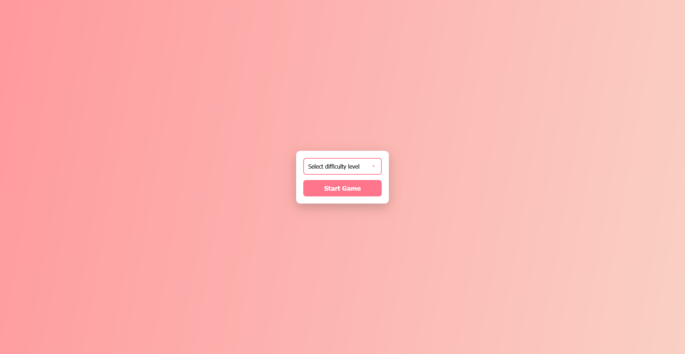

# Color Guessing Game

This is a simple color guessing game where the player has to guess the correct color from a set of options.

## Screenshot

## How to Play

1. The game will display a color in the main color box.
2. Choose the correct color from the options below.
3. If you guess correctly, your score will increase, and a new color will be displayed.
4. If you guess incorrectly, the game will display your final score and reset.

## Features

- Random color generation using HSL values.
- Score tracking.
- Responsive design for different screen sizes.
- Visual feedback for correct and incorrect guesses.

## Files

- `index.html`: The main HTML file that contains the structure of the game.
- `style.css`: The CSS file that styles the game.
- `script.js`: The JavaScript file that contains the game logic.
- `.vscode/settings.json`: Configuration for the Live Server extension.

## Setup

1. Clone the repository.
2. Open the project in Visual Studio Code.
3. Open `index.html` with Live Server to start the game.

## License

This project is licensed under the MIT License.
